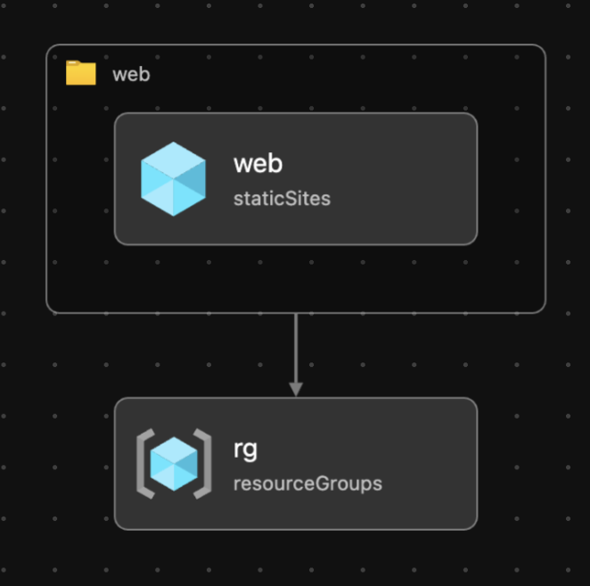

# Static Website Deployment Template

This template helps you quickly publish a static website to Azure Web App (Static Site).



## Features

- Deploy a Vue 3 application using Vite.
- Infrastructure as Code (IaC) with Bicep templates.
- Supports Azure's F1 (free) SKU for cost-effective hosting.

## Getting Started

### 1. Initialize the Template

Run the following command to clone the template and set up your environment:

```bash
azd init --template erudinsky/azd-static-web-vuejs
```

You will be prompted to provide:

- **Environment Name**: A unique prefix for the resource group that will hold all Azure resources.

### 2. Login to Azure

The `azd auth login` command is used to authenticate your Azure Developer CLI (azd) with your Azure account. This step ensures that the CLI has the necessary permissions to manage resources in your Azure subscription.

When you run this command, it will:

1. Open a browser window prompting you to log in to your Azure account.
2. Authenticate your session and link it to the Azure Developer CLI.

Once authenticated, you can seamlessly deploy and manage Azure resources using `azd` commands.

### 3. Deploy to Azure

Use the following command to build your application, provision Azure resources, and deploy the application:

```bash
azd up
```

This command will prompt you for:

- **Azure Location**: The region where your resources will be deployed.
- **Azure Subscription**: The subscription where your resources will be created.

### 3. Access Your Application

Once deployment is complete, you can access your static website using the URL provided in the output.

## Notes

- This template uses the F1 (free) SKU for Azure App Service, which has limited CPU and RAM resources. For production use, consider upgrading to a paid SKU.
- Refer to the [Azure Pricing Calculator](https://azure.microsoft.com/pricing/calculator/) for details on available SKUs and their costs.
- This template includes a sample Vue.js application located in `vue-app` directory. To use this template for your own Vue.js application, ensure that your app is located in `vue-app` or update the `project` attribute in the `azure.yaml` file accordingly.

## Resources

- [Vue 3 Documentation](https://vuejs.org/guide/introduction.html)
- [Vite Documentation](https://vitejs.dev/guide/)
- [Azure Developer CLI Documentation](https://learn.microsoft.com/azure/developer/azure-developer-cli/overview)